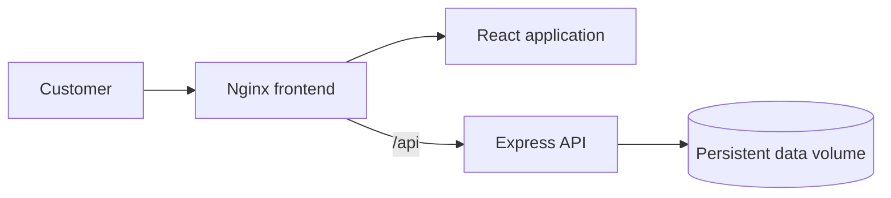

# Application & DevOps Portfolio

[](https://github.com/Sikhanyiso-omp/App-Projects/actions/workflows/ci.yml)


Production-minded applications demonstrating full-stack engineering, secure configuration, containerization, CI/CD foundations and operational documentation.

## Featured projects

| Project | What it demonstrates | Stack | Status |
| --- | --- | --- | --- |
| **Ngxatsho Legacy Wear** (repository root) | Full-stack commerce, authentication, inventory and order workflows | React, TypeScript, Express, Docker, Nginx | Portfolio-ready starter |
| **[ExamCoach SA](projects/examcoach-sa/)** | Authenticated learning SaaS, durable progress, timed assessments and Paystack-ready payments | React Server Components, Cloudflare D1, Drizzle, Paystack | [Live](https://examcoach-sa.essential59.chatgpt.site) |

## Ngxatsho Legacy Wear

A full-stack ecommerce foundation with a responsive product catalogue, customer authentication, cart and order history. The project is deliberately small enough to audit while still showing the boundaries found in a real service.

### System architecture



### Engineering highlights

- React + Vite + TypeScript frontend
- Express REST API with strict server-side validation
- Password hashing with Node.js `scrypt`
- Signed, expiring bearer tokens
- Inventory checks and user-scoped order history
- Security headers, request-size limits, CORS allowlist and rate limiting
- Multi-stage Docker image with separate frontend and API targets
- Nginx reverse proxy and SPA fallback
- Container health checks and persistent data volume
- GitHub Actions type-check, build and image validation
- Dependabot updates and documented security process

## Run locally

Prerequisites: Node.js 22+ and npm.

```bash
git clone https://github.com/Sikhanyiso-omp/App-Projects.git
cd App-Projects
cp .env.example .env
npm ci
npm run dev:server
```

In a second terminal:

```bash
npm run dev
```

Frontend: `http://localhost:3000`  
API health: `http://localhost:4000/api/health`

## Run with Docker Compose

Create `.env` from the example and replace the development secret with a long random value, then run:

```bash
docker compose up --build
```

Open `http://localhost:8080`. The browser talks to Nginx, which proxies `/api` to the private API container.

## Configuration

| Variable | Purpose | Local default |
| --- | --- | --- |
| `VITE_API_BASE_URL` | Browser API base URL | `http://localhost:4000/api` |
| `PORT` | API listening port | `4000` |
| `DB_PATH` | Persistent JSON datastore path | `./data/legacy-wear.json` |
| `JWT_SECRET` | Token-signing secret | Must be replaced |
| `CORS_ORIGIN` | Allowed browser origin | `http://localhost:3000` |

Never commit `.env` or real credentials.

## API surface

| Method | Route | Authentication |
| --- | --- | --- |
| GET | `/api/health` | Public |
| POST | `/api/auth/register` | Public |
| POST | `/api/auth/login` | Public |
| GET | `/api/products` | Public |
| POST | `/api/orders` | Bearer token |
| GET | `/api/orders/me` | Bearer token |

## Operations

- [Architecture and deployment decisions](docs/architecture.md)
- [Operational runbook](docs/runbook.md)
- [Security policy](SECURITY.md)
- [Contribution guide](CONTRIBUTING.md)

## Production roadmap

The JSON datastore is appropriate for a single-instance portfolio deployment. A production scale-out would replace it with PostgreSQL, move rate limiting to Redis, use managed secret storage, add automated API tests and ship structured logs and metrics to an observability platform.
