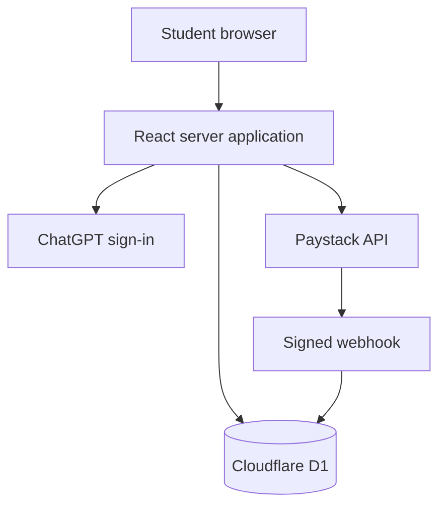

# ExamCoach SA

A production-deployed learning application that turns difficult university notes into focused lessons, exam-style practice, a daily plan and a measurable readiness score.

**Live application:** https://examcoach-sa.essential59.chatgpt.site

## Problem and outcome

Students often have notes but no reliable answer to three questions: what should I study, how should I solve it in the lecturer's expected method, and am I ready for the test? ExamCoach addresses that workflow with a free diagnostic, structured learning path and paid test booster.

## Product capabilities

- Authenticated student accounts
- Free five-question diagnostic
- Six structured CSP26W2 lessons
- Method-first worked examples and mastery checks
- Durable lesson progress and daily study tasks
- Timed ten-question mock with instant marking
- Readiness scoring and weak-topic guidance
- R49 once-off entitlement model
- Paystack initialization, callback verification and signed webhooks
- Owner-only revenue, content and feedback dashboard
- Privacy, terms and support flows

## Architecture

## Backend responsibilities

| Area | Implementation |
| --- | --- |
| Identity | Dispatch-provided authenticated user headers |
| Persistence | Cloudflare D1 accessed with Drizzle ORM |
| Content | Seeded module, lesson and assessment records |
| Progress | Lesson mastery, mock attempts and study tasks |
| Commerce | Purchase records, idempotent payment events and entitlements |
| Authorization | Email-bound student data and owner-only admin route |
| Payments | Server-side Paystack secret, verification and HMAC-SHA512 webhook validation |

## Repository layout

- `app/` — pages, server components, client interactions and API routes
- `db/` — relational schema and D1 access
- `drizzle/` — reviewed SQL migration
- `lib/` — content seeds, data access and payment services
- `worker/` — edge runtime entry point
- `scripts/` — verified build and environment wrappers

## Configuration

Copy `.env.example` for local development. Production secrets belong in the hosting platform's secret manager.

| Variable | Sensitivity | Purpose |
| --- | --- | --- |
| `OWNER_EMAIL` | Non-secret | Grants access to the owner console |
| `PUBLIC_APP_URL` | Non-secret | Canonical production URL |
| `PAYSTACK_SECRET_KEY` | Secret | Server-side payment initialization and verification |

Never expose `PAYSTACK_SECRET_KEY` in browser code or commit it to Git.

## Deployment

The application is deployed on OpenAI Sites with Cloudflare Workers, D1 and R2 bindings. The live runtime performs migrations before serving traffic. A deployment is accepted only after the production build and deployment-health checks succeed.

## Status and roadmap

The MVP is live. The next commercial steps are Paystack live-account activation, a controlled WSU pilot, analytics for diagnostic-to-purchase conversion, and additional module packs.

ExamCoach SA is an independent learning product and is not affiliated with or endorsed by Walter Sisulu University.
